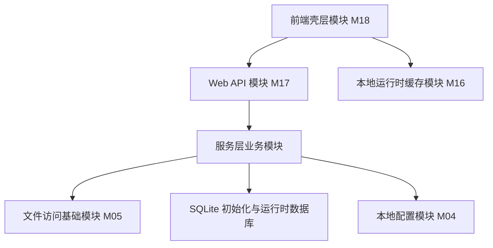
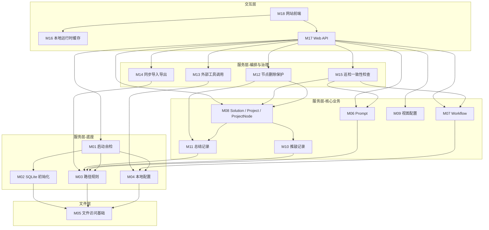

# 个人 AI 工作流导航器模块设计 v1

## 1. 文档目标

本文档主要解决以下问题：

- 系统应该拆成哪些模块
- 每个模块负责什么
- 每个模块不负责什么
- 模块之间如何依赖
- 推荐先实现哪些模块

本文档不解决：

- 具体接口字段命名
- 具体 SQL 迁移细节
- 具体前端组件实现
- AI 单次任务的执行提示词

---

## 2. 模块设计原则

### 2.1 不混层

模块设计必须继续服从系统设计中的三层架构：

1. 上层交互层
2. 中层服务层
3. 底层文件层

约束：

- 只能逐层调用
- 不允许上层直接改文件
- 不允许前端直接操作 SQLite
- 不允许底层文件模块承载业务判断

### 2.2 业务模块与基础设施模块分离

当前版本模块分为三类：

- 基础设施模块：负责启动、目录、数据库、配置、文件访问等稳定底座
- 业务模块：负责 Prompt、Workflow、Project、Node、同步、巡检等领域能力
- 交互模块：负责 Web API、网站前端页面与本地运行时缓存

### 2.3 编排模块与执行模块分离

一个模块如果负责“协调多个资源”，它应当是编排模块；
一个模块如果只负责“执行某一种能力”，它应当是执行模块。

例如：

- 节点删除保护模块属于编排模块
- 总结目录文件模块属于执行模块

### 2.4 文件内容与结构索引分离

模块设计必须持续遵守以下边界：

- SQLite 负责元数据、关系、查询、可同步视图配置
- 磁盘文件负责正文内容、对话内容、总结内容
- 本地缓存负责运行时选中状态与临时 UI 状态

### 2.5 模块边界优先于代码目录边界

当前仓库还没有完整代码实现，因此模块先定义“职责边界”，不强行等同于未来的文件夹切分。
后续代码目录应服务于模块边界，而不是反过来。

---

## 3. 模块总览

| 模块编号 | 模块名称                              | 层级   | 核心职责                                               |
| -------- | ------------------------------------- | ------ | ------------------------------------------------------ |
| M01      | 启动自检与环境引导模块                | 服务层 | 启动前检查运行条件并组织初始化流程                     |
| M02      | SQLite 初始化与 Schema 执行模块       | 服务层 | 创建数据库、执行 schema、保证运行时结构可用            |
| M03      | 工作目录与路径规则模块                | 服务层 | 校验并创建固定目录，统一相对路径解析规则               |
| M04      | 本地配置模块                          | 服务层 | 读取与校验 `local.config.jsonc`，提供配置访问能力    |
| M05      | 文件访问基础模块                      | 文件层 | 提供受约束的文件读写、列目录、存在性检查、移动删除能力 |
| M06      | Prompt 模块                           | 服务层 | 管理提示词元数据与正文文件                             |
| M07      | Workflow 模块                         | 服务层 | 管理工作流元数据、Mermaid 源码与节点动作绑定           |
| M08      | Solution / Project / ProjectNode 模块 | 服务层 | 管理方案、项目、节点、结构关系与节点工作流绑定         |
| M09      | Project 视图配置模块                  | 服务层 | 管理节点布局坐标和项目视角配置                         |
| M10      | 推敲记录文件模块                      | 服务层 | 管理节点 `deliberations/` 目录、目录入口与默认写入目标    |
| M11      | 总结记录文件模块                      | 服务层 | 管理节点 `summaries/` 目录、目录入口与文件列表读取   |
| M12      | 删除保护过程模块                      | 服务层 | 组织 Project / ProjectNode 删除确认、总结转存与删除流程 |
| M13      | 外部工具调用模块                      | 服务层 | 管理工具路由、命令参数拼装与执行前安全校验             |
| M14      | 同步导入导出模块                      | 服务层 | 在 SQLite 与 `dbSyncs/` 之间执行手动导入导出         |
| M15      | 巡检与一致性检查模块                  | 服务层 | 扫描索引缺失、文件缺失、失效绑定等异常                 |
| M16      | 本地运行时缓存模块                    | 交互层 | 保存当前选中节点等不入库状态                           |
| M17      | Web API 模块                          | 交互层 | 暴露统一接口，承接前端请求并调用服务层                 |
| M18      | 网站前端模块                          | 交互层 | 承载页面、交互、状态展示与用户动作触发                 |

---

## 4. 模块依赖关系

推荐依赖方向如下：

服务层内部推荐依赖顺序如下：

1. `M01` 依赖 `M02`、`M03`、`M04`
2. `M06` ~ `M15` 依赖 `M05`、数据库连接、必要时依赖 `M04`
3. `M12` 依赖 `M08`、`M11`、`M05`
4. `M14` 依赖数据库访问能力、`M05`、`M03`
5. `M15` 依赖 `M05`、数据库访问能力、`M04`
6. `M17` 作为统一入口依赖各服务模块
7. `M18` 只能依赖 `M17` 与 `M16`

禁止依赖：

- `M18` 直接依赖 `M05`
- `M18` 直接依赖 SQLite
- `M05` 反向依赖任何业务模块
- `M16` 作为本地缓存模块反向写入共享数据库

---

## 5. 详细模块设计

## 5.1 M01 启动自检与环境引导模块

职责：

- 组织服务启动流程
- 检查配置文件是否可读
- 检查工作目录和固定目录是否存在
- 检查数据库文件是否存在或可创建
- 组织 schema 执行与基础自检
- 输出统一的启动结果

不负责：

- 具体业务 CRUD
- 页面交互
- 任意修复业务脏数据

输入：

- 本地配置
- 工作目录根路径

输出：

- 启动状态
- 初始化报告
- 可供日志与页面展示的检查结果

依赖：

- `M02`
- `M03`
- `M04`

---

## 5.2 M02 SQLite 初始化与 Schema 执行模块

职责：

- 创建或打开运行时 SQLite
- 扫描并顺序执行 schema SQL
- 保证第一批表结构可用
- 提供数据库连接与事务入口

不负责：

- 推断业务语义
- 自动导入同步文件
- 自动修复任意数据内容

输入：

- 数据库路径
- schema 目录

输出：

- 可用数据库连接
- schema 执行结果

依赖：

- `M05`

---

## 5.3 M03 工作目录与路径规则模块

职责：

- 校验工作目录根路径
- 校验或创建固定目录
- 统一相对路径转绝对路径的解析规则
- 校验路径是否仍落在允许根目录内

固定目录至少包含：

- `db/`
- `dbSyncs/`
- `prompts/`
- `projects/`
- `summaryArchives/`

不负责：

- 读取具体业务内容
- 决定业务对象是否存在

输入：

- 工作目录根路径

输出：

- 目录检查结果
- 规范化后的路径解析能力

推荐代码落点：

- `server/src/infra/workspace/`

依赖：

- `M05`

---

## 5.4 M04 本地配置模块

职责：

- 读取 `local.config.jsonc`
- 校验配置格式
- 提供配置访问接口
- 提供外部工具配置、默认行为配置、端口配置

不负责：

- 直接执行外部工具
- 直接创建业务数据

输入：

- 配置文件路径

输出：

- 结构化配置对象
- 配置错误信息

依赖：

- `M05`

---

## 5.5 M05 文件访问基础模块

职责：

- 读文件
- 写文件
- 追加文件
- 列目录
- 判断文件或目录是否存在
- 创建目录
- 移动文件或目录
- 删除文件或目录

约束：

- 仅接受规范化后的路径
- 不理解 Prompt、Workflow、ProjectNode 等业务语义
- 删除和移动时必须支持安全校验

不负责：

- 决定写哪个推敲记录文件
- 决定节点是否允许删除
- 决定文件是否参与同步

---

## 5.6 M06 Prompt 模块

职责：

- Prompt 的增删改查
- 维护 Prompt 元数据
- 管理 Prompt 正文文件
- 提供快速读取与复制正文能力

写入边界：

- 元数据写入 `prompts`
- 正文写入 `prompts/` 目录下 `.md` 文件

不负责：

- 工作流渲染
- 节点动作执行

依赖：

- `M03`
- `M05`
- 数据库访问能力

---

## 5.7 M07 Workflow 模块

职责：

- Workflow 的增删改查
- 维护 Mermaid 源码
- 维护 `workflow_node_actions`
- 提供工作流渲染所需结构化数据
- 校验 Mermaid 节点绑定是否失效
- 在 Mermaid 源码变更后清理失效的节点动作绑定

写入边界：

- 工作流元数据与源码写入 `workflows`
- 节点动作绑定写入 `workflow_node_actions`

不负责：

- 直接复制 Prompt 正文
- 直接调用外部工具

依赖：

- 数据库访问能力
- `M04`

说明：

- `action_type = tool` 的校验需要读取工具配置
- 动作执行本身应委托给 `M13`
- 显式 `sync` 与隐式自动清理都收口在本模块内

---

## 5.8 M08 Solution / Project / ProjectNode 模块

职责：

- Solution 的增删改查
- Solution 与 Project 归属关系维护
- Project 的读取、创建、更新
- ProjectNode 的读取、创建、更新
- 项目结构关系维护
- 节点与工作流绑定维护
- 项目与节点目录初始化
- 协调节点内容目录入口初始化

写入边界：

- 元数据写入 `solutions`、`projects`、`project_nodes`
- 关系写入 `solution_projects`、`project_node_relations`
- 节点工作流绑定写入 `project_node_workflows`
- 节点内容目录入口初始化协调 `deliberations_records`、`summary_records`
- 目录写入 `projects/<project-folder>/<node-folder>/`

不负责：

- Project 删除保护流程
- ProjectNode 删除保护流程
- 节点布局保存
- 推敲记录文件追加
- 总结删除保护

依赖：

- `M03`
- `M05`
- `M10`
- `M11`
- 数据库访问能力

---

## 5.9 M09 Project 视图配置模块

职责：

- 保存节点坐标
- 读取节点坐标
- 保存项目视角位置与缩放
- 读取项目视角位置与缩放

写入边界：

- 节点坐标写入 `project_node_layouts`
- 项目视角写入 `project_viewports`

不负责：

- 前端画布交互细节
- 本机临时缩放状态缓存

依赖：

- 数据库访问能力

---

## 5.10 M10 推敲记录文件模块

职责：

- 管理节点 `deliberations/` 目录
- 维护 `deliberations_records` 目录入口记录
- 读取推敲记录文件列表
- 选择“最新合规文件”作为默认写入目标
- 在无合规文件时自动创建新的推敲记录文件
- 追加内容到默认写入目标
- 手动新建新的推敲记录文件

规则重点：

- 只按文件名时间戳判定“最新”
- 不合规文件允许展示，但不参与默认写入目标判定
- 节点存在但目录入口缺失时，不在本模块自动补齐，应由巡检或启动自检暴露问题

写入边界：

- 目录入口写入 `deliberations_records`
- 文件目录写入 `projects/<project-folder>/<node-folder>/deliberations/`

不负责：

- 抓取网页对话
- 识别消息角色

依赖：

- `M03`
- `M05`
- 数据库访问能力

---

## 5.11 M11 总结记录文件模块

职责：

- 管理节点 `summaries/` 目录
- 维护 `summary_records` 目录入口记录
- 读取总结文件列表
- 提供总结目录存在性与非空判定
- 为节点详情页提供文件列表数据

规则重点：

- 文件名不要求时间戳
- 不做“最新文件”判定
- 节点存在但目录入口缺失时，不在本模块自动补齐，应由巡检或启动自检暴露问题

写入边界：

- 目录入口写入 `summary_records`
- 文件目录写入 `projects/<project-folder>/<node-folder>/summaries/`

不负责：

- 自动生成总结内容
- 删除前二次确认编排

依赖：

- `M03`
- `M05`
- 数据库访问能力

---

## 5.12 M12 删除保护过程模块

职责：

- 组织 Project 删除确认流程
- 组织节点删除确认流程
- 检查 `summaries/` 是否非空
- 在需要时执行二次提醒
- 执行总结转存到 `summaryArchives/`
- 将直接子节点改写为根层孤岛节点
- 按原相对顺序将这些节点连续追加到根层末尾
- 保持这些节点已有的持久化画布坐标不变
- 在保护流程通过后调用节点删除

删除流程编排建议：

1. 检查节点是否存在
2. 检查 `summaries/` 是否非空
3. 若为空，按一次确认流程删除
4. 若非空，要求二次确认
5. 若选择转存，先校验目标归档目录不存在；若已存在则失败
6. 若目标归档目录可用，先转存再删除
7. 若存在直接子节点，先将其改写为根层孤岛节点
8. 将这些直接子节点按原相对顺序连续追加到根层末尾，并分配确定的根层 `sortOrder`
9. 删除当前节点自身
10. 若转存或孤岛改写失败，中止删除

不负责：

- 节点结构查询
- 总结文件内容解析

依赖：

- `M08`
- `M11`
- `M05`
- 数据库事务能力

补充说明：

- 当前实现层建议拆成 `project-deletion` 与 `project-node-deletion` 两个过程模块
- 二者都属于 `M12` 这一类删除保护过程能力

---

## 5.13 M13 外部工具调用模块

职责：

- 读取工具定义与路由配置
- 按动作类型拼装命令参数
- 解析相对路径到绝对路径
- 执行前做路径安全校验
- 提供统一的工具调用结果

支持的能力至少包括：

- `openFile`
- `openFolder`
- `openPath`
- `openAtLine`

不负责：

- 决定业务上应该打开哪个文件
- 保存业务绑定关系

依赖：

- `M04`
- `M03`
- `M05`

推荐代码落点：

- `server/src/processes/external-tools/`
- `infra/tools` 只保留注册表与执行器，不承接业务路由与安全策略

---

## 5.14 M14 同步导入导出模块

职责：

- 从 SQLite 导出表级 CSV 到 `dbSyncs/`
- 生成与读取 `manifest.json`
- 从 `dbSyncs/` 导入恢复 SQLite 数据
- 提供“清空后重建”的导入策略

当前范围：

- 只处理结构化数据与可同步视图配置
- 不负责业务正文文件的 Git 同步
- `deliberations.csv` 与 `summaries.csv` 属于正式导入输入的一部分
- 缺失时导入失败，文件存在但内容非法时同样导入失败

不负责：

- 自动触发导入导出
- 自动回滚
- 自动解决冲突

依赖：

- `M03`
- `M05`
- 数据库访问能力

---

## 5.15 M15 巡检与一致性检查模块

职责：

- 检查数据库索引存在但文件缺失
- 检查文件存在但索引缺失
- 检查 Mermaid 节点动作绑定是否因源码变更而失效
- 在启用“必须绑定”策略时，提示工作流节点未绑定动作
- 在启用“必须绑定”策略时，提示项目节点未绑定工作流
- 检查绑定关系引用不存在对象
- 检查 `toolKey` 是否失效

输出建议：

- 巡检项类型
- 对象标识
- 严重级别
- 修复建议

不负责：

- 自动批量修复所有问题
- 越过确认直接删除对象

依赖：

- `M04`
- `M05`
- `M06`
- `M07`
- `M08`

---

## 5.16 M16 本地运行时缓存模块

职责：

- 保存 `active_project_node_id`
- 保存 `active_workflow_node_id`
- 保存仅属于当前端的 UI 状态
- 提供清理本地缓存入口

不负责：

- 跨机器同步
- 写入共享 SQLite

说明：

- 该模块只存在于网站前端

---

## 5.17 M17 Web API 模块

职责：

- 提供统一 HTTP API
- 做请求参数校验
- 调用服务层模块
- 返回统一响应结构
- 映射错误语义

不负责：

- 页面状态管理
- 业务规则最终定义

依赖：

- `M01` ~ `M15`

说明：

- 它是交互层进入服务层的正式入口
- 不应在控制器中堆叠复杂业务逻辑

---

## 5.18 M18 网站前端模块

职责：

- 提供维护页面
- 提供项目结构可视化页面
- 提供节点详情面板与节点详情交互
- 调用 Web API
- 维护本机 UI 状态

页面范围至少包括：

- Prompt 管理页
- Workflow 管理页
- Project / Node 管理页
- 方案视角页
- 巡检页
- 配置页

不负责：

- 直接操作磁盘
- 直接操作数据库
- 重新定义业务规则

依赖：

- `M16`
- `M17`

---

## 6. 推荐实现顺序

当前建议按以下顺序推进：

### 第一阶段：稳定底座

1. `M05` 文件访问基础模块
2. `M04` 本地配置模块
3. `M03` 工作目录与路径规则模块
4. `M02` SQLite 初始化与 Schema 执行模块
5. `M01` 启动自检与环境引导模块

目标：

- 服务可以稳定启动
- 固定目录可用
- 数据库结构可用

### 第二阶段：核心领域对象

1. `M06` Prompt 模块
2. `M07` Workflow 模块
3. `M08` Solution / Project / ProjectNode 模块
4. `M09` Project 视图配置模块

目标：

- 核心业务对象可稳定维护，Project 删除走保护动作
- 项目结构和视图配置可持久化

### 第三阶段：节点内容与风险流程

1. `M10` 推敲记录文件模块
2. `M11` 总结记录文件模块
3. `M12` 节点删除保护模块
4. `M13` 外部工具调用模块

目标：

- 节点上下文真正可用
- 删除流程可控
- 工具联动可落地

### 第四阶段：一致性与同步

1. `M14` 同步导入导出模块
2. `M15` 巡检与一致性检查模块

目标：

- 数据可导出导入
- 异常可发现

### 第五阶段：对外入口与界面

1. `M17` Web API 模块
2. `M16` 本地运行时缓存模块
3. `M18` 前端壳层模块

目标：

- 系统可交互
- UI 状态与业务状态边界清晰

---

## 7. 模块到下一层的收敛要求

完成本层后，下一层 `L4` 接口与数据契约应重点补齐以下内容：

1. `M01` 的启动检查项、自修复项、失败语义
2. `M03` 的目录存在性规则、自动创建规则、路径越界规则
3. `M06` ~ `M09` 的 CRUD API 契约
4. `M10` 的最新推敲记录文件判定契约
5. `M12` 的一次确认与二次确认契约
6. `M13` 的工具动作输入输出契约
7. `M14` 的导入导出文件格式契约
8. `M15` 的巡检结果结构契约

---

## 8. 当前结论

当前版本的模块设计结论如下：

1. 系统应先拆成基础设施模块、领域模块、交互模块三大类。
2. 节点删除保护、同步、巡检都应作为独立模块，而不是散落在 CRUD 模块中。
3. `deliberations/` 与 `summaries/` 必须拆成两个模块，避免规则混淆。
4. 工作流管理与工作流节点动作绑定应放在同一模块内统一维护。
5. Project 节点布局与 Project 视角配置应独立成模块，不并入 Project CRUD。
6. 本地运行时缓存必须单独建模，不能与共享 SQLite 混用。
7. Web API 是交互层进入服务层的唯一正式入口。
8. 后续最值得继续推进的工作，不是再扩大全局设计，而是直接进入 `L4` 接口与数据契约设计。

